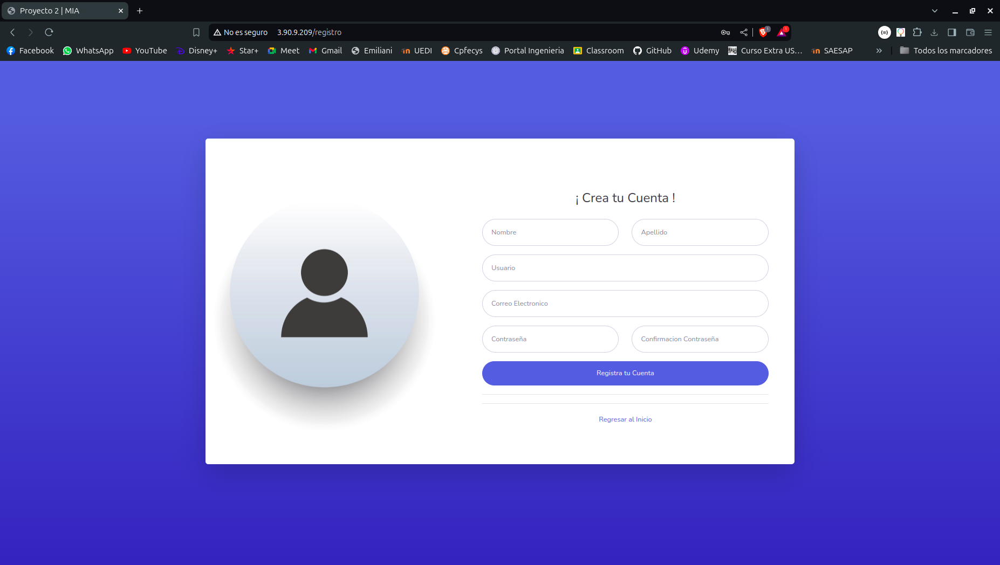
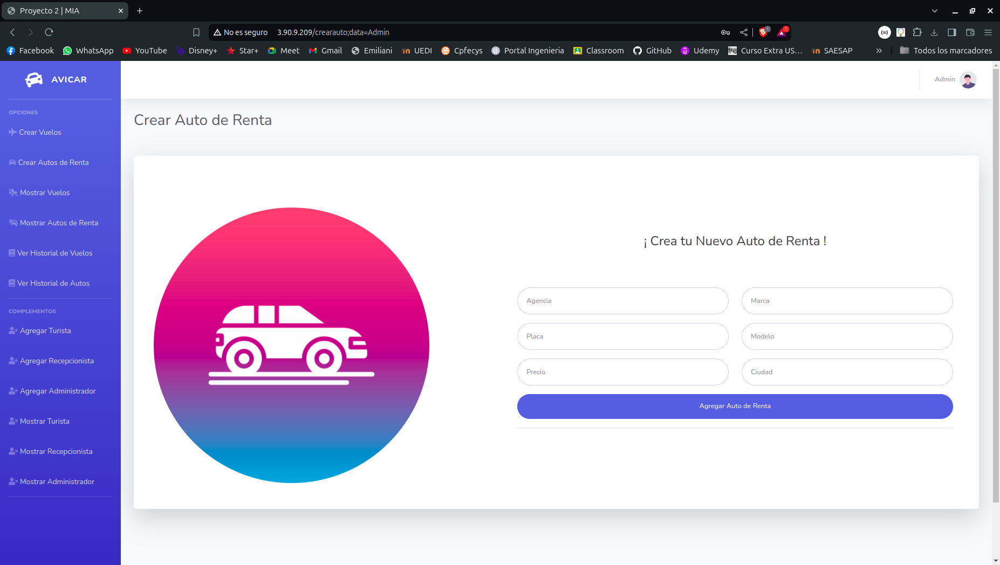

# Manual de Usuario - AVICAR

## Introducción
AviCar es un sistema diseñado para gestionar viajes de turistas alrededor del mundo, proporcionando una experiencia completa y agradable post pandemia. Este manual le guiará en el uso de la aplicación AviCar.

## Objetivos
- Aprender a administrar archivos y estructuras en NodeJS.
- Comprender la funcionalidad de un flujo de archivos JSON.
- Aplicar la teoría de archivos JSON.
- Utilizar un framework (Angular, React, Vue).
- Administrar usuarios y permisos mediante grupos.
- Restringir y administrar el acceso a los archivos como administrador, cliente y recepcionista.
- Crear una aplicación visual.
- Utilizar servicios en la nube (AWS).

## Descripción de la Aplicación
AviCar permite a los usuarios gestionar vuelos y alquiler de automóviles. Existen tres tipos de usuarios: Turista, Recepcionista y Administrador.

### Tipos de Usuario
1. **Usuario Turista**: Puede visualizar y reservar vuelos y automóviles.
2. **Usuario Recepcionista**: Aprueba o rechaza solicitudes de vuelos y alquileres de automóviles.
3. **Usuario Administrador**: Gestiona usuarios, vuelos y automóviles.

## Registro e Inicio de Sesión
### Inicio de Sesión
- **Correo electrónico/Usuario**
- **Contraseña**

### Registro de Usuario
- **Nombre completo**
- **Usuario**
- **Foto de perfil**
- **Correo electrónico**
- **Contraseña**
- **Confirmación de contraseña**

### Registro de Viajes
- **Nombre de la agencia**
- **Ciudad de origen**
- **Ciudad de destino**
- **Días de vuelo**
- **Precio de vuelo**

### Registro de Autos
- **Nombre de la agencia**
- **Marca**
- **Placa**
- **Modelo**
- **Precio**
- **Ciudad del vehículo**

### Registro de Recepcionista
- **Nombre completo**
- **Usuario**
- **Foto de perfil**
- **Correo electrónico**
- **Contraseña**
- **Confirmación de contraseña**

## Renta de Vuelos y Autos
El usuario turista puede filtrar vuelos y autos por:

### Vuelos
- **Nombre de agencia**
- **Ciudad de origen**
- **Ciudad de destino**
- **Días de vuelo**
- **Precio de vuelo**

### Autos
- **Nombre de la agencia**
- **Marca**
- **Modelo**
- **Precio**

## Requisitos Técnicos
1. AviCar debe tener backend, frontend y gestor de datos con archivos JSON.
2. Utilizar Cognito de AWS para el registro de nuevos usuarios.
3. Almacenar fotos de perfil en S3 de AWS.
4. No usar bases de datos, solo archivos JSON.
5. Ejecutar el programa en una EC2 de AWS.
6. Crear usuarios IAM necesarios para el manejo de servicios de AWS.
7. Uso de un repositorio Git para el control de versiones.

## Uso de la Aplicación
### Acceso y Registro
1. **Inicio de sesión**: Ingrese su correo electrónico y contraseña.
2. **Registro de nuevo usuario**: Complete el formulario de registro con los datos solicitados.

### Gestión de Vuelos y Autos
1. **Reservar vuelo**: Filtre y seleccione el vuelo deseado, luego confirme su reserva.
2. **Alquilar auto**: Filtre y seleccione el automóvil deseado, luego confirme su alquiler.

### Gestión de Usuarios
1. **Administrador**: Puede agregar o eliminar usuarios turistas y recepcionistas.
2. **Recepcionista**: Puede aprobar o rechazar solicitudes de vuelos y autos.

## Capturas de Pantalla y Descripción
Proporcione capturas de pantalla de las principales funcionalidades y descripciones detalladas para guiar a los usuarios en el uso de la aplicación.
1. **Pagina principal**


1. **Vuelos Disponibles**


1. **Carros de Renta Disponibles**


1. **Inicio de Sesion**


1. **Registro **


1. **Pagina Principal Administrador**


1. **Crear Carros de Renta**


1. **PCrear Vuelos de Viajes**


1. **Mostrar Vuelos de Viaje**


1. **Mostrar Carros de Renta**


1. **Mostrar Usuarios Turistas**


1. **Pagina principal Recepcionista**


1. **Historial de Reservas**


1. **Pagina principal de Turista**


1. **Vista para Reservas**


1. **Listado de Reservas**


```
